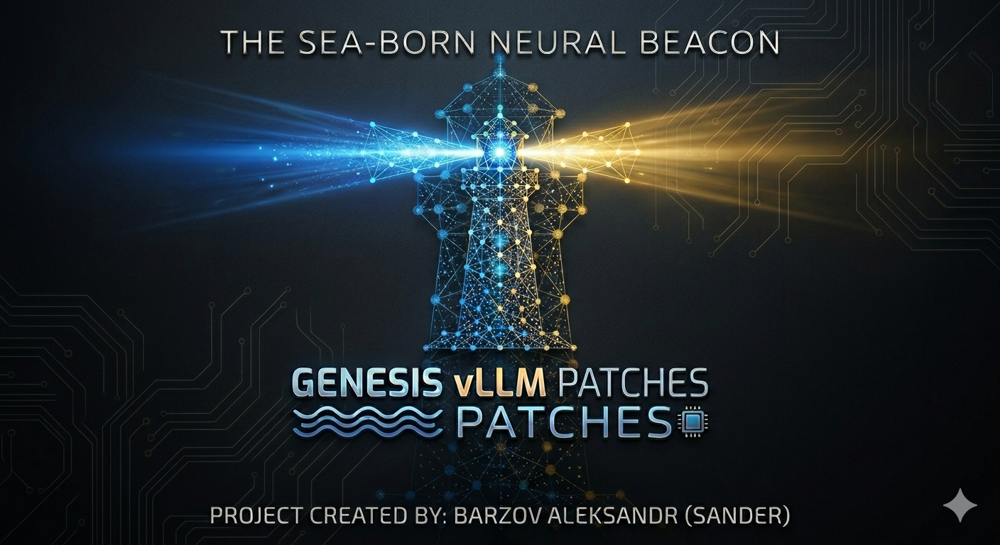

<p align="center">
  
</p>

# Genesis vLLM Patches

[](LICENSE)
[](https://github.com/vllm-project/vllm)
[](#status-and-open-problems)
[-purple.svg)](docs/HARDWARE.md)

**A personal, work-in-progress fork of runtime patches for
[vLLM](https://github.com/vllm-project/vllm), tuned to run one 27B hybrid-GDN
model at 256K context on two consumer RTX 3090s.**

## Read this first

This is **not a product**. It is a working notebook with code attached:

- **It targets one machine.** 2× RTX 3090 (sm_86), TP=2, PCIe gen4 ×8, no
  NVLink, 30 GB of host RAM, one specific quantized checkpoint. Numbers,
  thresholds and several patches are tuned to exactly that. On different
  hardware, expect some patches to be useless and others to be wrong.
- **It is in active development.** Patches land, get measured, and sometimes
  get deleted when the measurement says the idea was wrong. The git history
  contains retractions on purpose — see §[Dead ends](#dead-ends).
- **It pins to vLLM 0.29.0.** Patching is by text anchors, so a different vLLM
  version will silently skip patches rather than fail loudly. There is a
  preflight tool for that (below), and it should be run before any bump.
- **Documentation is bilingual.** Code comments and commit messages are in
  Spanish; the docs under `docs/` are being moved to English.

> Forked from [Sandermage/genesis-vllm-patches](https://github.com/Sandermage/genesis-vllm-patches),
> re-targeted from Qwen3.6 / RTX A5000 to **Qwen3.8-27B on 2× RTX 3090**, and
> moved from vLLM 0.27.1 to **0.29.0**. Upstream's patch framework, dispatcher
> and most patches below PN120 are theirs; the PTX kernels and everything from
> **PN120 up** are this fork's.

---

## What is running right now

```
compose/docker-compose.qwen38-27b-noon-dflash2-v029.yml   →  genesis-27b-dflash2
```

This is the container serving today, and the one to copy if you want a known-good
starting point.

| | |
|---|---|
| Model | `noon-at-cgn/Qwen3.8-27B-Uncensored-W4A16-AutoRound` — hybrid GDN, 48 linear-attention + 16 full-attention layers |
| Engine | vLLM 0.29.0 + Genesis |
| Hardware | 2× RTX 3090 (sm_86), TP=2, PCIe, no NVLink |
| Speculative decoding | **DFlash2** W4A16 drafter, `num_speculative_tokens=8` |
| Weights / activations | fp16 · W4A8 Marlin (`VLLM_MARLIN_INPUT_DTYPE=int8`) |
| KV cache | `int8_per_token_head`, served by this project's integer decode kernel |
| Context | 262 144 tokens · `max-num-seqs 10` · `gpu-memory-utilization 0.92` |
| **KV capacity** | **566 314 tokens** — 2.16× concurrency at full context |
| Address on this host | `172.20.0.228:8320`, alias `vllm-server` |

A second compose keeps the **MTP** drafter as a fallback path:
`compose/docker-compose.qwen38-27b-noon-w4a8-v029.yml` → `genesis-27b-v029`.
The two are mutually exclusive: they share the IP and the `vllm-server` alias,
so whichever is up owns the endpoint.

### Measured performance

Measured 2026-09-19 against the container above, after one long warm-up, with
cache-busted prompts (a different seed per run). Instrument is this project's
own script, one shot per run — **not** the warmed `bench.sh` harness, so these
are a floor, not a best case.

| | mean | range | n |
|---|---|---|---|
| prefill @ 10K | **2901** tok/s | 2896 – 2907 | 3 |
| prefill @ 90K | **1873** tok/s | 1844 – 1913 | 3 |
| decode, narrative | **121** tok/s | 109 – 128 | 4 |
| decode, code | **197** tok/s | 132 – 257 | 4 |

Decode spread is real, not noise: throughput tracks DFlash2's acceptance rate,
which depends heavily on the content being generated (code accepts far more
draft tokens than prose). Prefill, by contrast, is tight — CV 0.2% at 10K.

Behavioural quality is checked with `quality-test.sh --quick` from
[club-3090](https://github.com/noonghunna/club-3090) (ToolCall-15 +
InstructFollow-15): **27/30**, with `pass@k=3` reporting zero flaky failures.

---

## What this fork adds

The dispatcher holds **103 patch entries**; **56 are active** in the production
container above. Everything from PN120 up is this fork's work. Active ones are
marked ✅.

### Kernels and quantization

| | | |
|---|---|---|
| ✅ | **PN130** | Own Marlin W4A8 with signed int16 scales (vllm#48905) |
| ✅ | **PN125** | Positive scales for Marlin W4A8-INT8 on AutoRound checkpoints — upstream produced silent garbage with negative scales |
| ✅ | **PN131** | Integer attention decode, **SK-18h in hand-written PTX**, over `int8_per_token_head` KV |
| ✅ | **PN124** | Fast TRITON_ATTN on Ampere for head dim 256 |
| | PN134-137 | int8 activation quantization fused with RMSNorm; group smoothing folded into the weights (exact SmoothQuant) |
| | PN126 | q/k rotation (Hadamard / WUSH) after RoPE |
| | PN139 | int4 per-group `lm_head` |

### KV cache and capacity

| | | |
|---|---|---|
| ✅ | **PN145** | Sliding-window block aligned with primary attention |
| ✅ | **PN146** | Selectable KV group size — upstream's heuristic picks badly on hybrid models |
| ✅ | **PN122** | MTP rollback on GDN without speculative blocks |
| ✅ | **PN127** | `MambaManager` honours `drop_eagle_block` (vllm#48375) |
| ✅ | **PN121** | Preemption-cascade guard with deferred frees |

PN145 + PN146 together, plus giving the drafter int8 KV, took KV capacity from
178 823 to **566 314 tokens (+217%)**.

### Speculative decoding

| | | |
|---|---|---|
| ✅ | **PN142** | DFlash2 usable on 0.29.0 (vllm#51581 + port of `fa5017a5`) |
| ✅ | **PN144** | Scales the DFlash2 drafter's residual so it fits fp16 — the drafter ships in bf16 and overflowed at 50 080 against fp16's 65 504 ceiling, accepting 0%. Note the `eps` trap: RMSNorm is scale-invariant but `eps` is not |
| ✅ | **PN128** | Async input-prep waits for spec-decode post-processing (GDN+MTP) |
| | PN132/PN133 | Trimmed vocabulary and W8A8 linears for the MTP drafter |

### Communication and infrastructure

| | | |
|---|---|---|
| ✅ | **PN120** | TP all-reduce compressed to INT8 during prefill (+6.5% prefill) |
| ✅ | **PN143** | Genesis hooks into *every* vLLM process via `load_general_plugins()` |
| | PN136 | MLP all-reduce overlapped with compute over direct P2P |

PN143 exists because `apply_all` runs as a separate process and then `exec`s
`vllm serve`: anything registered in memory is lost across that boundary. This
bit us silently once — the server booted, logged "applied", and ran the generic
kernel anyway.

### Tiered KV cache (RAM + NVMe)

The most involved subsystem, and the most honest about its limits. Full write-up
in **[docs/KV-OFFLOADING.md](docs/KV-OFFLOADING.md)**.

Three of this project's own patches had it deadlocked: it wrote 50 GB per run
and had never returned a single hit. `PN97` refused every L3→L2 promotion once
L2 was permanently full; `PN91`'s 0.2 s deferral budget expired before the
asynchronous promotions resolved, and in strict mode an in-flight block scores
as a miss, vetoing the whole lookup; `PN81`'s quota made L3 **smaller than L1**
while pruning by write age.

With all three fixed, rescuing an evicted 20K prompt costs **1.21 s instead of
6.88 s (−82.5%)**, reproducible across three runs from a clean disk.

**But** — under live traffic it still returns **0 external hits**, because
`_lookup_complete_chunks` requires all nine KV-cache groups to hit and real
traffic produces partial matches that get discarded wholesale. L1 carries the
load at 76.4%. Do not enable this expecting a win yet.

---

## Getting started

### 1. Credentials

Every compose reads its API key from the environment. **Nothing secret is
versioned** — `.env` is gitignored, only `.env.example` is tracked.

```bash
cp compose/.env.example compose/.env
openssl rand -hex 32          # generate a real key, paste it into compose/.env
```

Benchmark and diagnostic scripts read the same `VLLM_API_KEY` **with no
default**: a script run without it fails loudly instead of sending a stale key.

### 2. Run

```bash
cd compose
docker compose -f docker-compose.qwen38-27b-noon-dflash2-v029.yml up -d
docker inspect genesis-27b-dflash2 --format '{{.State.Health.Status}}'
```

The healthcheck **generates a token** rather than pinging `/health`. A server
that boots but produces garbage is reported unhealthy — that has caught real
failures here.

### 3. Verify

```bash
# every patch decision, with its reason
docker logs genesis-27b-dflash2 2>&1 | grep "Genesis Dispatcher"

# KV capacity actually obtained
docker logs genesis-27b-dflash2 2>&1 | grep "GPU KV cache size"
```

### Before bumping vLLM

Anchor patching **fails silently when upstream moves a line**: the patch reports
`SKIPPED`, the server boots without it, and the only symptom is lower
throughput. Run:

```bash
python3 -m vllm._genesis.preflight_anclajes --bajar v0.29.0
```

It checks every anchor against the target tree without downloading an image, and
reports which patches would break *and actually run in this configuration*.

---

## Status and open problems

Kept deliberately honest — these are the things you would otherwise discover the
hard way:

- **KV offload returns 0 external hits under real traffic.** The mechanism works
  and the synthetic rescue is reproducible, but the all-groups-must-hit
  constraint means partial matches are wasted. See
  [docs/KV-OFFLOADING.md](docs/KV-OFFLOADING.md) §4.
- **About 8.5% of boots on 0.29.0 came up broken** — the model emits two tokens
  and stops. The generation-based healthcheck catches it. Root cause still open.
- **vLLM 0.29.0 is validated here but is not on the inherited pin allowlist.**
  Boot logs a pin-gate warning; that is expected, not a fault.
- **PCIe links negotiate gen4 ×8, not ×16** on this machine. Every number above
  was measured under that constraint.
- **PN91's deferral budget (15 s / 400 steps) is generous by judgement, not by
  measurement.** The minimum that still hits all nine groups has not been
  bisected.

### Dead ends

Recorded so they are not repeated. Both came from single runs and both had to be
retracted:

- **"The draft group vetoes the other groups' hit, remove the veto."** A patch
  (PN147) was written, applied, and measured with a successful rescue — n=1, and
  it did not reproduce. With PN91's budget raised and PN147 *off*, the same group
  hits 19/19. The data was always there. PN147 was deleted.
- **"PN100's staging ring wastes 44% of L2, disabling it gains capacity."**
  Worse: the attention prefix went from 12/20 to 0/20 hits. Bounding ephemeral
  traffic is what protects the long thread's prefix.

This subsystem has genuine run-to-run variance. Take every result with a clean
disk, a restart, and at least two repetitions.

---

## Repository layout

```
vllm/_genesis/        the patches, kernels and dispatcher — the project itself
  ├─ wiring/          one module per patch, grouped by subsystem
  ├─ kernels/         PTX and Triton kernels (integer attention, Marlin, GDN)
  └─ tests/           unit tests for the patch machinery
compose/              the two engine composes + .env.example
tests/
  ├─ bench/medicion/  one script per question (acceptance, KV blocks, concurrency)
  ├─ bench/resultados/raw benchmark output, with the config that produced it
  └─ repro/           standalone harnesses that reproduce upstream bugs without a GPU
docs/                 patch ledger, hardware notes, subsystem write-ups
benchmarks/           historical measurement campaigns
```

Each patch states in its own docstring *why* it exists and what was measured.
Patches carry `upstream_drift_markers` and retire themselves once they detect
that upstream merged the underlying fix.

---

## Credits

Built on [Sandermage/genesis-vllm-patches](https://github.com/Sandermage/genesis-vllm-patches).
Several fixes and the whole measurement methodology come from
[noonghunna/club-3090](https://github.com/noonghunna/club-3090), whose benchmark
and quality harnesses are used here directly.

Apache 2.0 — see [LICENSE](LICENSE).
